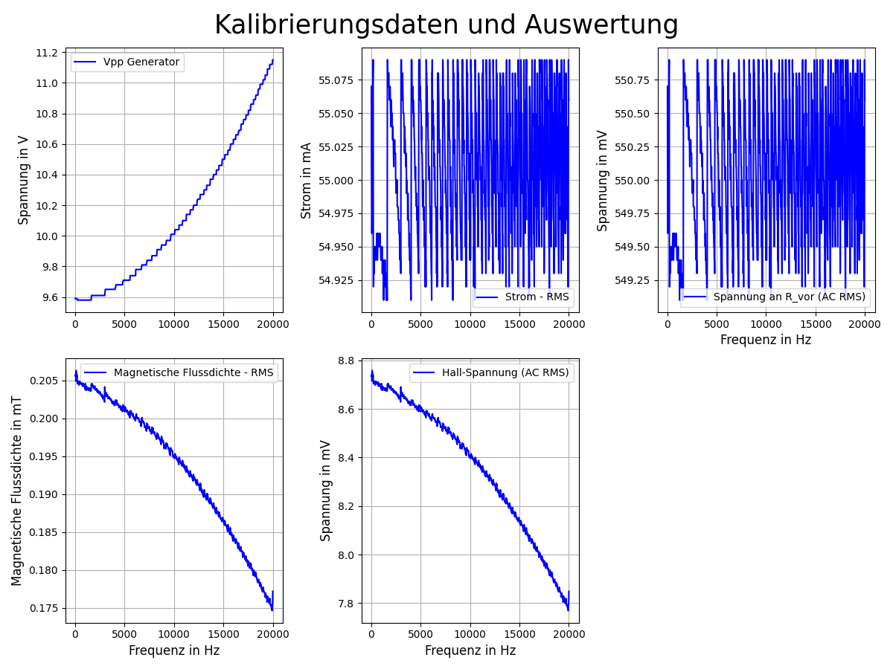
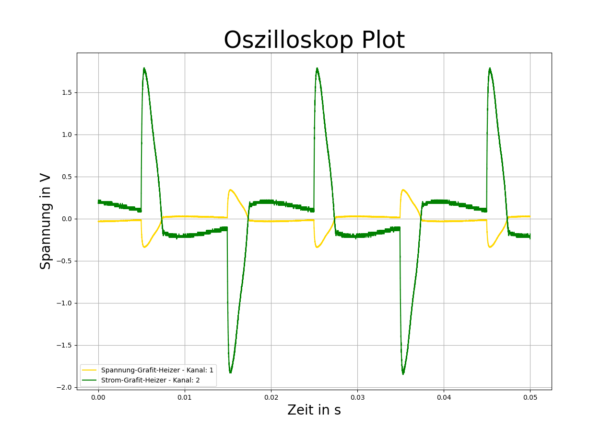
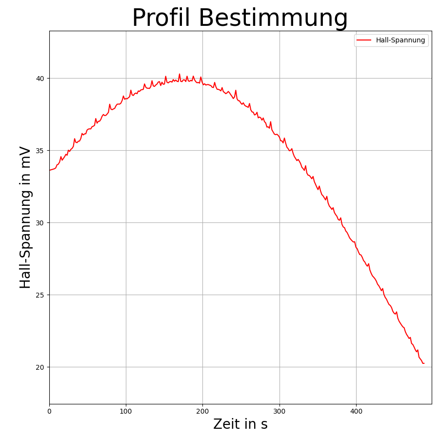

# 1. Programs
The programs mentioned below all work with coils. Firstly, there is a program for calibration, for measuring the performance of the coil and for recording profiles on the test CZ coil. The programs are explained below.

## 1.1. main program_calibration.py
The program was used to calibrate a Hall sensor using a Helmholtz coil. The program talks to the Keithley multimeter (DAQ) and the Keysight oscilloscope. Various strings and values ​​are passed to the program via a parameter list.

## 1.1. hauptprogramm_Kalibrierung.py
The program was used to calibrate a Hall sensor using a Helmholtz coil. The program talks to the Keithley multimeter (DAQ) and the Keysight oscilloscope. Various strings and values ​​are passed to the program via a parameter list.

**Program sequence:**
1. Read the parameter list (**parameter_Kalibrierung.yml**) and make it available for the program
2. Initialize the Keysight oscilloscope
    - Read and transfer VID and PID
    - Query identification (name) and output in console
3. Initialize the Keithley device
    - Initialize interface
    - Perform device reset
    - Output device name
4. Create the value buffer for Keithley
5. Save the processing of the frequencies
6. Read experiment data and check whether the frequency runs from high to low or from small to high
7. Read the function type and amplitude of the voltage and pass it on to the device
8. Read the GitHub version
9. Create file name and create the folder and file header
    - Heading, current date, GitHub version
    - Devices used
    - Experiment information such as: Coil used, Hall sensor supply and presets
    -> Everything is taken from the parameter list (except version and date)
10. Measurement and processing

Up to point 10 The basics are dealt with. In point 10, the measurement of the Hall voltage and the change of frequency are carried out. How the lines work exactly is explained below.

**Measurement:**
The measurement takes place in a **for loop**. This for loop runs according to the frequency specifications. For example, if you run from 20 Hz to 20 kHz in 20 Hz steps, these are all processed. When specifying, you have to make sure that the steps from the start value to the end value are consistent, otherwise rough steps will arise. To reach the end value, you have to take this plus the step value. If you want it to be different, you have to calculate the step and end value differently. The above example can also be reversed; to do this, you just have to set **reverse** to True in the parameter list under **Frequency**. This would make the start value the end value and the end value the start value, and the number of steps would then be negative.

At the start of the measurement, the current frequency is passed to the oscilloscope. To give the device some time, there is a delay of 1 s. The current RMS value of the voltage is then read out (specifying the channel - here voltage across the coil's series resistor) and saved.

In the **while loop** the current or voltage is now kept constant (I = U/R --> U and I are proportional - R constant). The parameter list can be used to specify the target value, the desired range and the correction of Vpp. If the current voltage value is not in the range, the loop is executed. The loop is executed until the amplitude (Vpp) of the generator voltage generates a voltage on the selected channel that is in the range. Depending on whether the voltage is higher or lower, the amplitude is corrected up or down, but the value cannot rise above 12 V, as this is where the device's maximum is.

After the correction, the amplitude is sent to the device and the voltage on the selected channel is determined again.

If the value is in the range, the multimeter, i.e. the Hall voltage, is queried. At the beginning (after the first measurement) there is a delay of 5 s in the program. This delay comes from testing the device, as the device needs a certain amount of time to select the AC channel and give the first measured value. After that everything works.
The voltage is then read out, the unit is determined and the value is converted to volts using the **um** function. The voltage value on the channel and the amplitude of the oscilloscope are then saved and appended to the file.

When the program is finished, this is confirmed by a console output.

**Functions**
The **Read_Output()** function is only used to read the multimeter.

Since the multimeter is read in such a way that the exact value is taken from the screen, the unit is also read. The **um()** function can be used to convert the unit into volts. The function comes from my studies at the HTW in the software technology module, from one of the laboratory tasks (written by me). The function gets the value, the current unit and the desired unit. The function works via the **unit** list. First, the list position of the desired unit and current unit is searched for. The difference between the two values ​​multiplied by 3 gives the 10th power for the conversion.

Example:
- we want V
    - list position = 3 = e2
- we have mV
    - list position = 2 = e1
- value = 1000
- calculation:
    - new_value = value x 10^((e1-e2) x 3) = 1000 x 10^((2-3) x 3) = 1000 x 10^(-3) = 1

Due to problems with the conversion to float, rounding has been added for mV and kV.

**Evaluating the data:**
The program **Evaluation_Text-File.py** is used to create diagrams for the text document created. The program is quite simple:
    - it reads out all lines (skips the header)
    - Hall voltage without magnetic field and series resistor must be entered via the console (but is also in the text file (depends on the version))
    - calculates current and magnetic flux density
    - outputs everything over time in five diagrams
    - saves the diagram automatically

Diagram:

---

## 1.2. hauptprogramm_Leistung.py

This program can be used to read the screen of the Keysight oscilloscope. All y-values ​​are returned in a string from the device and the sampling rate of the curve. There are 4 channels in total, these channels can be assigned via the parameter list **parameter_Leistungs.yml**. The VID and PID numbers are transferred via the list, the number of curves for the diagram with channel number and curve label. Furthermore, under **Measurement** you can enter a note about the time of the measurement. In the program this is then placed in the header of the file with a time stamp.

The program works with classes. Each curve is then given its own class in which the values ​​of the parameter list are saved and the data is read from the oscilloscope. In addition, each curve is given its own text file or its own file name in the class.

In addition to creating the text file, the data is plotted in a diagram. For each object, the text file with the file name is created and the curve is generated. The device itself has certain colors for the channels, this has also been implemented here.

- Channel 1 - Yellow (here gold)
- Channel 2 - Green
- Channel 3 - Blue
- Channel 4 - Red

The header of the text file contains the time steps (sampling rate) and when the measurement was carried out. The read data is then entered.
In the next step, the diagram data is created and the y-values ​​are converted to floats. In this step, blank lines should be skipped; in some tests (without a curve), blank lines were created that caused the program to crash. For this reason, only text lines should be considered and an error should be output during the conversion with float(). If everything worked, the curve is created.

When the last curve or last object is completed, the diagram is created, which is then saved. The folder and name are created by the diagram itself. You have to be careful here, though, as the names are created separately, which means that things can get messy if you're not careful.

This program can also be used for other applications with the oscilloscope.

Diagram:

---

## 1.3. hauptprogramm_Profil.py

The program was written to create profiles for the development of the magnetic field in a moving Hall sensor.

The structure of the program comes from the AutoTune program for determining emissivity (exp-T-control-v2). The **um()** function is also used here. The program records the Hall voltage and plots it live over time.

**Program flow:**
1. Set variable **nStart** to False
2. Provide parameter list (parameter_Profil.yml)
3. Initialize Keithley multimeter (DAQ) (interface)
4. Perform device reset
5. Read device name
6. Create buffer
7. Create GUI (call function) - simple GUI just start and end
8. Press start
    - File is created with file header (enter the default settings and experiment sequence data from the parameter list), folder created
    - Start time determined
    - nStart set to True - prevent the function from being activated and Start being pressed again
    - Graphic is created
9. get_Measurment() is executed (ideally every second)
    - dt is determined
    - Multimeter is addressed, ask for Hall voltage
        - Call the 5s delay the first time
    - Call function um()
    - Update lists
    - Expand file
    - Update graphic (with autoscaling)
10. When Stop is pressed
    - Measurement is ended
    - Image is saved
    - Program is terminated

**Evaluation file:**
With the program **Profil_Zeit_Hall-Spannung.py** you can display the profile data next to each other by entering it in a dictionary!

To do this, the curves are read out of their text files in a loop and plotted together. The diagram must be saved manually.

With **Profil_Umrechnung.py** the time values ​​are converted into a path or angle and a plot and a text file are created with the new data. The magnetic flux density B is also calculated from the Hall voltage here.

The program **Profil_Kurvenschar_Weg-Rot_Magnetfeld.py** creates a plot from the new curves with all the selected or specified curves.

Diagram:   

# 2. Other

Some parts of the programs were taken from various other programs such as emissivity determination/temperature control and AutoTune. For example, the program structure for profile determination comes from the AutoTune programs. Repeated program lines such as creating files and folders, creating the file name or reading the version from GitHub are also included here.

The programs for determining the emissivity, temperature control and AutoTune were also written as part of the bachelor thesis in the model experiments group of the IKZ.

## 2.1. Program sources
- https://dev.to/days_64/python-hex-function-convert-decimal-to-hexadecimal-33am
- Using hex()

## 2.2. Example file
The ["Beispiel_Datein"](../Beispiel_Datein) folder contains the Yaml files that are relevant for the programs!
