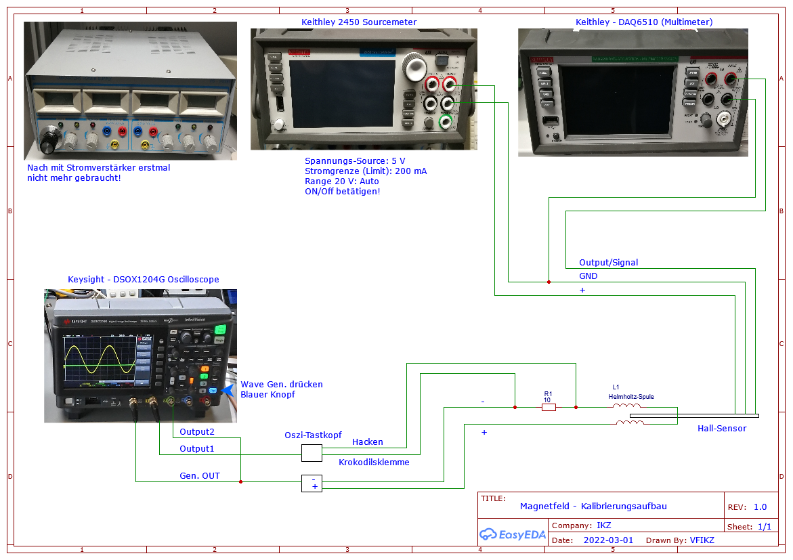
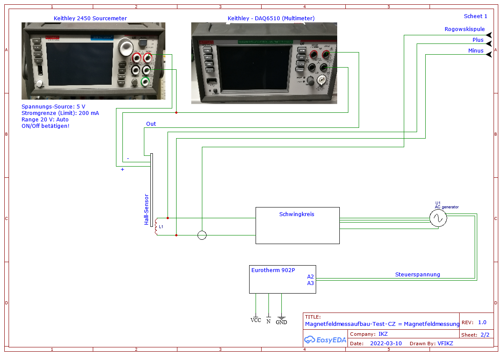

# exp-B-control
Diese Programme wurden während der Bachelorarbeit von Vincent Funke am Institut für Kristallzüchtung (IKZ) erstellt. Dabei wurde die [Gruppe Modellexperimente](https://www.ikz-berlin.de/forschung-lehre/materialwissenschaften/sektion-fundamentale-beschreibung-1) unterstützt. Das Thema der Arbeit war:   
 
*Resistive und induktive Heizung in einer Kristallzüchtungsanlage: Automatisierung mit Python und Vermessung der elektromagnetischen Parameter*

## Experiment: Magnetfeldkontrolle 

Im Sinne des Experimentes zur Kontrolle des Magnetfeldes wurden zwei Experimente durchgeführt:

1. Kalibrierung eines Hall-Sensors
2. Magnetfeldmessung in der Anlage (Test-CZ) der Modellexperimente-Gruppe

Hierfür werden verschiedene Geräte verwendet, die unter dem Punkt [Unterstützte Geräte](#Unterstützte-Geräte) zu finden sind. Das Ziel ist es das Magnetfeld von Spulen zu bestimmen. 

Die Validierung und die ersten Versuche wurden mit einer selbstgewickelten Helmholtzspule durchgeführt. Die Spule hat einen Durchmesser von 20 mm und 60 Windungen je Spulenteil. 

In dem Experiment sollen mit Hilfe drei Geräte das Magnetfeld von Spulen bestimmt werden. Die ersten Test und die Validierung sollen mit einer Helmholtzspule stattfinden. Mit der Helmholtzspule wurde ein Hall-Sensor kalibriert. Bei den Überlegungen des Aufbaus wurde auch ein Stromverstärker gebaut, welcher jedoch noch gescheiterten Versuchen nicht weiter genutzt wurde.  

In der Test-CZ (auch Nemo-1-Anlage genannt) sollen nun mit Hilfe des Hall-Sensors und der Kalibrierungswerte, die Magnetfelder der Anlagenspule aufgenommen werden. Zur Messung wird ein Hall-Sensor verwendet, mit dem die Hall-Spannung gemessen wird. Diese Spannung wird dann für die Kalibrierung über eine Formel in die magnetische Flussdichte umgerechnet. Daraufhin kann man eine Kalibrierungskurve erstellen mit der dann die Messungen umgewandelt werden können. 

## Experiment: Leistungsmessung von resistiven und induktiven Heizungen

In dem Experiment ging es darum die Leistung der verscheidenen Heizer (Widerstandsheizer und Induktionsheizer) zu bestimmen. Hierbei werden Spannungs- (Spannungsmessung mit Differentialtastkopf - DP10013 von Micsig) und Strommessgeräte (Rogowskispule Typ MA 200) genutzt und über ein Oszilloskop ausgerwertet. Mit dem Programm werden die Messdaten dieses Gerätes ausgelesen, als auch die Kurve auf dem Gerät gespeichert. 

## Experiment-Aufbau:
### Kalibrierung Hall-Sensor

### Magnetfeldmessung in der Test-CZ Anlage

### Leistungsmessung in der Test-CZ Anlage

## Unterstützte Geräte

Mit dem Oszilloskop von Keysight sollen die Frequenzen und Amplituden verändert werden, das Multimeter von Keithley misst die Hall-Spannung und das Sourcemeter (nicht programmiert) liefert die Versorgungsspannung. 

1. DSOX1204G Oszilloskop von Keysight (USB)
2. DAQ6510 Multimeter von Keithley (RS232)

## Programme

### Hauptprogramme

1. [hauptprogramm_Kalibrierung.py](../hauptprogramm_Kalibrierung.py)
    - Kalibrierungs-Programm für Hall-Sensor (Aufnahme Messdaten)
2. [hauptprogramm_Leistung.py](../hauptprogramm_Leistung.py)
    - Messung der Leistung durch Aufnahme der Oszilloskop-Kurven
3. [hauptprogramm_Profil.py](../hauptprogramm_Profil.py)
    - Aufnahme von Magnetfeldprofilen einer Spule

### Auswertungsprogramme

1. [Auswertung_Text-Datei.py](../Auswertung/Auswertung_Text-Datei.py)
2. [Profil_Kurvenschar_Weg-Rot_Magnetfeld.py](../Auswertung/Profil_Kurvenschar_Weg-Rot_Magnetfeld.py)
3. [Profil_Kurvenschar_Zeit_Hall-Spannung.py](../Auswertung/Profil_Kurvenschar_Zeit_Hall-Spannung.py)
4. [Profil_Umrechnung.py](../Auswertung/Profil_Umrechnung.py)

### Test-Programme
Mit den beiden Testprogramm kann man einfach Befehle austesten.

**Keithley:**    
[Kommunikationstest_1-Keithley-DAQ.py](../Test-Programme/Kommunikationstest_1-Keithley-DAQ.py)

Im Programm findet man verschiedene Befehle, teilweise auch auskommentiert die einfach über die Erstellung der oben in Kapitel 1 genannten Programm verwendet wurden.

**Keysight:**  
[Kommunikationstest_2-Keysight-Oscilloscope.py](../Test-Programme/Kommunikationstest_2-Keysight-Oscilloscope.py)

Im Programm findet man verschiedene Befehle, teilweise auch auskommentiert die einfach über die Erstellung der oben in Kapitel 1 genannten Programm verwendet wurden.

## Benutzung/ Zu den Programmen

1. Konfiguration durch die Config (Yaml) Datei:
    - hauptprogramm_Kalibrierung.py - Template: [Beispiel_parameter_Kalibrierung.yml](../Beispiel_Datein/Yaml/Beispiel_parameter_Kalibrierung.yml)
    - hauptprogramm_Leistung.py - Template: [Beispiel_parameter_Leistung.yml](../Beispiel_Datein/Yaml/Beispiel_parameter_Leistung.yml)
    - hauptprogramm_Profil.py - Template: [Beispiel_parameter_Profil.yml](../Beispiel_Datein/Yaml/Beispiel_parameter_Profil.yml)

    - Bei der Nutzung muss dann "Beispiel_" entfernt werden. 

2. Bemerkungen Haupt-/Messprogramme:
    - hauptprogramm_Kalibrierung.py
        - `python .\hauptprogramm_Kalibrierung.py`
        - Arbeitet Schleife ab
        - Ende: `print("\nProgramm abgearbeitet!")` 
        - Erzeugnisse (Beispiele):
            - Pfad: Daten\Daten_vom_2022_03_02
            - Datei: 2022_03_02_#01_volt.txt ([Beispiel](../Beispiel_Datein/Hauptprogramm/Beispiel_Text_Datei_Kalibrierung.txt))
    - hauptprogramm_Leistung.py
        - `python .\hauptprogramm_Leistung.py`
        - Bild wird gespeichert
        - Erzeugnisse (Beispiele):
            - Pfad:     Daten/Oszi-Daten_vom_2022_03_04
            - Datei:   
            2022_03_04_Nr01_Leistung_Spannung_Vor-Widerstand.txt ([Beispiel](../Beispiel_Datein/Hauptprogramm/Beispiel_Text_Datei_Leistung.txt))    
            2022_03_04_Nr01_Leistung_Spannung_Vor-Widerstand.png ([Beispiel](../Beispiel_Datein/Hauptprogramm/Beispiel_Bild_Datei_Leistung.png))
    - hauptprogramm_Profil.py
        - `python .\hauptprogramm_Profil.py`
        - tkinter Umgebung öffnet sich
        - Live-Plot ist zu sehen
        - Erzeugnisse (Beispiele):
            - Pfad:     Daten/Daten_vom_2022_03_10/Profil
            - Datei:    2022_03_10_#01_Profil.txt ([Beispiel](../Beispiel_Datein/Hauptprogramm/Beispiel_Text_Datei_Profil.txt))
                        2022_03_10_#01_Profil_Bild.png ([Beispiel](../Beispiel_Datein/Hauptprogramm/Beispiel_Bild_Datei_Profil.png))

3. Auswertungsprogramme:
    1. Auswertung_Text-Datei.py    
        Der Ordner [Daten](../Daten) beinhaltet ein Beispiel hierfür. Wenn das Programm gestartet wird, wird ein Plot erstellt!
        - File in Variable `lese_File` eingeben: z.B. `2022_03_04_#01_volt.txt`
        - Programm Starten: `python .\Auswertung_Text-Datei.py`
        - Eingabe der Hall-Spannung ohne Magnetfeld in mV und des Vorwiderstand in Ohm  (Konsoleneingabe)
        - Plot öffnet sich
        - Erzeugnisse (Beispiele):
            - Pfad: Daten\Daten_vom_2022_03_02_#01
            - Bild: 2022_03_02_#01_volt_Bild_#01.png ([Beispiel](../Beispiel_Datein/Auswertung/Beispiel_Auswertung_Text-Datei.png))
    2. Profil_Kurvenschar_Weg-Rot_Magnetfeld.py   
        Der Ordner [Daten](../Daten) beinhaltet ein Beispiel hierfür. Wenn das Programm gestartet wird, wird ein Plot erstellt!
        - Pfad und Bezeichnung werden im Dictionary `data` definiert
        - Programm Starten: `python .\Profil_Kurvenschar_Weg-Rot_Magnetfeld.py`
        - [Beispiel](../Beispiel_Datein/Auswertung/Beispiel_Profil_Kurvenschar_Zeit_Hall-Spannung.png)
    3. Profil_Umrechnung.py   
         Der Ordner [Daten](../Daten) beinhaltet ein Beispiel hierfür. Wenn das Programm gestartet wird, wird ein Plot erstellt! Das Ergebniss ist dort zu finden und wird für Punkt 4 verwendet!
        - Erzeugnisse (Beispiele):
            Pfad:   Daten/Profil-Umrechnung (Wird im Ausführungsordner erzeugt!)
        - Pfad in Variable `folder` angeben
        - Bewegung (Hub, Rotation) in `bewegung` und Bewegungsrichtung (auf, ab bzw. CCW, CW) in `richtung_hub` bzw. `richtung_rot` angeben
        - Werte in `weg_beginn`, `weg_Ende`und `rotation_Begin`festlegen
        - Programm Starten: `python .\Profil_Umrechnung.py`
        - [Beispiel_1](../Beispiel_Datein/Auswertung/Beispiel_Bild_Datei_Umrechnung_Profil_Hub.png)
        - [Beispiel_2](../Beispiel_Datein/Auswertung/Beispiel_Bild_Datei_Umrechnung_Profil_Rot.png)
            - weitere im besagten oberen Ordner!
    4. Profil_Kurvenschar_Weg-Rot_Magnetfeld.py   
        Der Ordner [Daten](../Daten) beinhaltet ein Beispiel hierfür. Wenn das Programm gestartet wird, wird ein Plot erstellt!
        - Pfad und Bezeichnung werden im Dictionary `data` definiert
        - Programm Starten: `python .\Profil_Kurvenschar_Weg-Rot_Magnetfeld.py`
        - [Beispiel](../Beispiel_Datein/Auswertung/Beispiel_Profil_Kurvenschar_Weg-Rot_Magnetfeld.png)

## Abhängigkeiten

Die Programme arbeiten mit Python. Genutzt wurden Windows und Raspberry Pi.

**Genutzte Bibliotheken:**

1. hauptprogramm_Kalibrierung.py
    - numpy
    - serial
    - yaml
    - datetime
    - os
    - subprocess
    - time
    - usbtmc

2. hauptprogramm_Profil.py
    - serial
    - time
    - datetime  
    - tkinter                           
    - numpy                              
    - matplotlib
    - os
    - yaml
    - subprocess  

3. hauptprogramm_Profil.py
    - usbtmc
    - numpy
    - matplotlib
    - os
    - yaml
    - datetime

4. Auswertung_Text-Datei.py
    - numpy 
    - matplotlib
    - os

5. Profil_Kurvenschar_Weg-Rot_Magnetfeld.py
    - numpy 
    - matplotlib
    - os

6. Profil_Kurvenschar_Zeit_Hall-Spannung.py
    - numpy 
    - matplotlib
    - os

7. Profil_Umrechnung.py
    - numpy 
    - matplotlib
    - os
    - math 

8. Kommunikationstest_1-Keithley-DAQ.py
    - serial
    - time

9. Kommunikationstest_2-Keysight-Oscilloscope.py
    - usbtmc   
    - numpy
    - matplotlib
    - os

## Dokumente 

Weitere Informationen zu den Programmen und ihrer Nutzung, sowie Informationen zu dem Experiment können in der Bachelorarbeit nachgelesen werden!

Link: 

## Informationen

Im Ordner **[Info](../Info)** befinden sich weitere Dokumente, die die Programme näher beschreiben. Folgende Themen sind dort in Deutsch und Englisch zu finden:

1. Erläuterung der Befehle:
    - [Zeige En](geräte_Befehle_etc_En.md)
    - [Zeige De](geräte_Befehle_etc_DE.md)
2. Erläuterung des Programmcode:
    - [Zeige En](Programm_Info_En.md)
    - [Zeige De](Programm_Info_DE.md) 
3. Auswertungsprogramme:
    - [Zeige En](Auswertung_En.md)
    - [Zeige De](Auswertung_De.md) 