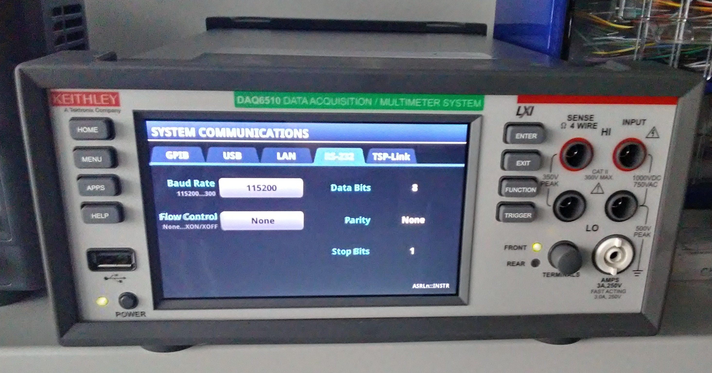
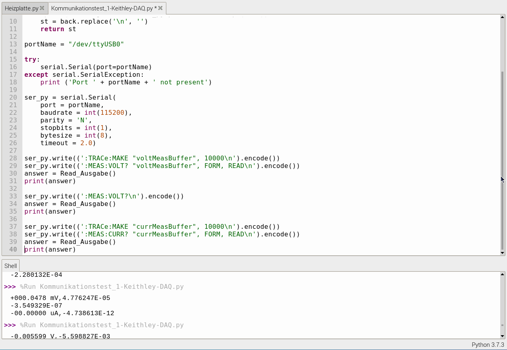
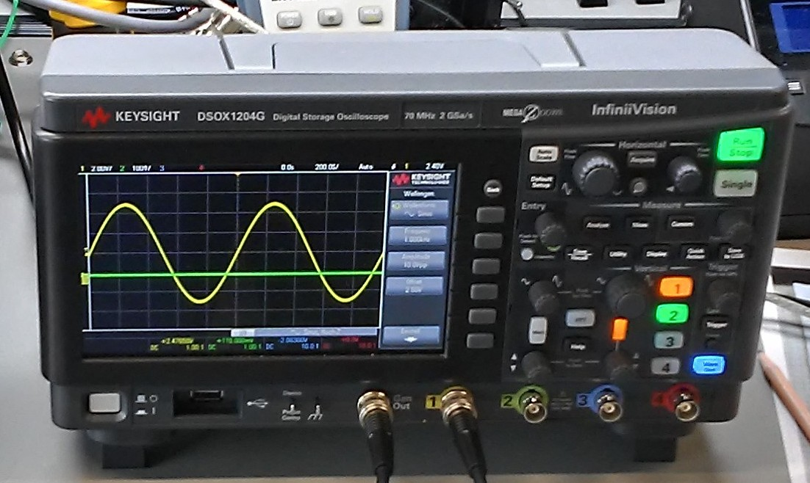

## 1. Keithley - DAQ6510     

### 1.1. Commissioning
The device can be used with the Python library serially via the RS232 interface of the device. The program "Kommunikationstest_1-Keithley-DAQ.py" serves as a test program and shows a couple of example commands. The multimeter should be used to measure the Hall voltage.

1. Find out the communication settings
    - can be found on the device's screen
    1. Press the menu button
    2. In the "System" column, press "Communication"
    3. Select RS232
    4. Baud rate can be set here, the other values ​​can be read
    

    - in the document "DAQ6510-901-01B_Sept_2019_Ref.pdf" you can read this on the following pages:
        - p. 91 - Menu overview (step 2)
        - p. 125 - 126 - Explanation of what is shown in the picture above
        - from p. 416 (Chapter 11) - SCPI commands

### 1.2. Commands
The Keysight and Keithley devices use SCPI commands. SCPI stands for "Standard Commands for Programmable Instruments".

All formalities for programming are in the document "DAQ6510-901-01B_Sept_2019_Ref.pdf" on pages 416 to 421. Here is just a short list of the special features:

- Commands begin with a : (colon) (see p. 416) (exception p. 417)
- Queries are marked with a question mark (see p. 417)
- The capital letters in the commands are the minimum characters that the command must have, the lowercase letters can be omitted, but if written with then completely (see p. 418)
- For "common commands" (p. 417) it is sufficient to put a * before the command
- Parameters come after the command, command and parameters are separated by a space (see p. 417)
- You can read more on the pages

(for the paragraphs (up to here) the source "DAQ6510-901-01B_Sept_2019_Ref.pdf" pp. 416 - 421 was used)

*Commands we use*:
Page numbers refer to the document "DAQ6510-901-01B_Sept_2019_Ref.pdf"!

**Measure values**:
1. :MEASure?
    - only reading possible
    - p. 431 - 433
    - Function used: **VOLTage** or **CURRent**
    - Example: **:MEAS:VOLT? "voltMeasBuffer", FORM, READ**
        - what is in quotation marks is a buffer with which you can reformat the read value
    - Example: **:MEAS:VOLT?**
    
    In the picture you can see the difference between the two examples. Using the buffer you can use **Form** to display the device screen value and with **Read** the value is simply read out and displayed in exponential notation. The exponential notation is also selected without specifying a buffer. (The different values ​​are due to the fact that the device fluctuated extremely during the test.)
    - a good example of the use of the command (also used for the test program) can be found on page 433

    - in the `hauptprogramm.py` files the command is used like this:
    **:MEAS:VOLT:AC? "{buffer_U}", FORM**
        - by default the DC value is read out, therefore AC must be specified
        - the buffer comes from the parameter list
        - with form the value is displayed as on the screen
        - in our case we need AC for the Hall voltage measurement
        - a delay must be built into the programs because the device has to set the AC channel

**Create buffer**:
1. :TRACe:MAKE
    - with this command you can create a buffer that can then be read by the user
    - p. 616 - 617
    - Example: **:TRACe:MAKE "voltMeasBuffer", 10000**

**Other commands:**
1. *RST
    - Reset the device, buffers created by the user are deleted
    - prevents an error message due to the buffer on the device
    - p. 1230

2. *IDN?
    - Request the device name
    - p. 1228

**Programming with Python:**
When sending a command, a \n is appended to the end of the command,which is filtered out again when decoding.

### 1.3. Sources
- DAQ6510-901-01B_Sept_2019_Ref.pdf
- can be found at: https://download.tek.com/manual/DAQ6510-901-01B_Sept_2019_Ref.pdf

---

## 2. Keysight - DSOX1204G 

This is what the device used looks like:

### 2.1. Commissioning
This chapter explains how to get the device to communicate with the computer. The test program "Kommunikationstest_2-Keysight-Oscilloscope.py" shows basic SCPI commands (including the commented ones), the use of usbtmc and a small for loop that changes the frequency on the device.

1. Use the Python library: https://github.com/python-ivi/python-usbtmc
- The page explains how to install the library correctly, but here is a brief summary:
    1. Download the library
    2. Unzip the zip file
    3. Go to the folder containing the file (in the unzipped folder) `setup.py`
    4. Open the console window in the folder
    5. Run `sudo python setup.py install` under Linux

2. enter "lsusb" in the console
    - this will tell you the idVendor and idProduct
    - this is what it looked like for us: Bus 001 Device 058: ID 2a8d:0396
    - 2a8d = idVendor, 0396 = idProduct
    - **Tip**: Run it once before switching on to see what changes, this will quickly tell you what belongs to the device

3. Create the file "usbtmc.rules" in the folder /etc/udev/rules.d as described on GitHub
    - here is a short procedure:
    1. Go to the folder /etc/udev/rules.d
    2. You can create the file with "sudo touch usbtmc.rules"
    3. Run "sudo mc"
    4. Go to the file "usbtmc.rules" and click Edit
    5. Enter the text from the GitHub page with the correct IDs
    6. Save and exit

4. Further steps
    1. run "sudo groupadd usbtmc" to add the group
    2. run "sudo usermod -a -G usbtmc pi"
    3. Restart the computer

5. run the small test program on the Github page
    - if the following error occurs, it might help to unplug the USB plug from the device and plug it back in again
    Error: **usb.core.USBError: [Errno 13] Access denied (insufficient permissions)**

6. Start
    - To start the measurement you have to do the following:
    1. Connect something to "Gen Out" and a channel
    2. Press the "Wave Gen" button
    3. Optional: Press "Auto Scale"

### 2.2. Commands
The device uses SCPI commands. In the experiment, we want to use the oscilloscope to change the frequency for calibration and possibly also measure the current.

The following commands are relevant for the program:
A command is passed using the "write" function and read using "ask". In the document "9018-07747.pdf" the command tables are divided into three columns: Command for writing, Query for reading and the third column shows what options you have and what the device will answer. The following page references refer to the document just mentioned!

**Wave Generator**:
Abbreviation: WGEN
1. :WGEN:FREQuency `<frequency>`
    - this can be used to specify the frequency that the wave should have
    - Example reading: **:WGEN:FREQuency?**
    - Example writing: **:WGEN:FREQuency 50**
    - p. 107 - Table 38
2. :WGEN:FUNCtion `<signal>`
    - this can be used to specify the form/function that the wave should have
    - e.g. sine or ramp
    - Example reading: **:WGEN:FUNCtion?**
    - Example writing: **:WGEN:FUNCtion SINusoid**
    - p. 107 - Table 38
3. :WGEN:VOLTage `<amplitude>`
    - this can be used to specify the amplitude that the wave should have
    - Example reading: **:WGEN:VOLTage?**
    - Example writing: **:WGEN:VOLTage 10**
    - The specified value is a Vpp voltage (peak-to-peak)
    - p. 109 - Table 38

**Measurements**:
1. :MEASure:VPP [`<source>`]
    - Measures the peak voltage of the specified channel
    - Example reading: **:MEAS:VPP?** or **:MEAS:VPP? CHAN2**
    - p. 83 - Table 18
2. :MEASure:VRMS [`<interval>`][,] [`<type>`][,] [`<source>`]
    - Measures the effective voltage of the specified channel (RMS - Root Mean Sqaure)
    - Example reading: **:MEAS:VRMS?** or **:MEAS:VRMS? CHAN2**
    - p. 83 - Table 18
    - Use in program - Calibration:
    **:MEAS:VRMS? AC, CHAN" + str(channel)**
        - Here too, the default is DC, so you have to have AC read out here too
        - the channel is specified via the respective parameter list
    
**Other**:
1. *IDN?
    - read only
    - returns the identity of the device
    - example read: ***IDN?**
    - example response: KEYSIGHT TECHNOLOGIES,DSOX1204G,CN61367122,02.11.2020062221
    - p. 57 - Table 2
2. :AUToscale
    - the command triggers an AutoScale on the oscilloscope screen, but it cannot be used in the program because it slows down the program considerably
    - p. 141 - Table 45

In **hauptprogramm_Leistung.py** there are further commands used. These are used to read all the data from the screen.

**Read screen:**
1. :WAVeform:FORMat `<value>`
    - this allows you to specify the format of the data output - ASCII in our case
    - Example: **:WAV:FORM ASCii**
    - Page 653 - Table 87
2. :WAVeform:SOURce `<source>`
    - with this command you tell the device which of the 4 channels should be read
    - Example: **:WAVeform:SOURce CHAN" + str(self.channel number)**
    (Parameter list - channel number)
    - Page 654 - Table 87
3. :WAVeform:DATA?
    - the command reads the oscilloscope's y-axis in full, the data is returned in a string and separated by commas, for Python this means that the **split** function should be called
    - ***ATTENTION***: The header is attached to the first value, e.g. #800001000 (example taken from p. 663) - this is deleted (cut away) in the program
    - Example: **:WAVeform:DATA?**
    - p. 653 - Table 87
4. :WAVeform:XINCrement?
    - the command returns the sampling time, i.e. the steps of the x-axis
    - p. 655 - Table 87
    - Example output: +4.00000000E-009

### 2.3. Sources
- https://github.com/python-ivi/python-usbtmc
    - Python library for communication via USB
- 9018-07747.pdf
    - can be found at: https://www.keysight.com/de/de/assets/9018-07747/programming-guides/9018-07747.pdf (you have to provide an email address to access)
    - the PDF contains the commands for communication
    - the page numbers refer to the document
- https://stackoverflow.com/questions/50625363/usberror-errno-13-access-denied-insufficient-permissions
    - Solution for access errors found here
- https://www.batronix.com/files/Keysight/Oszilloskope/1000X/1000X-Manual.pdf
    - Manual