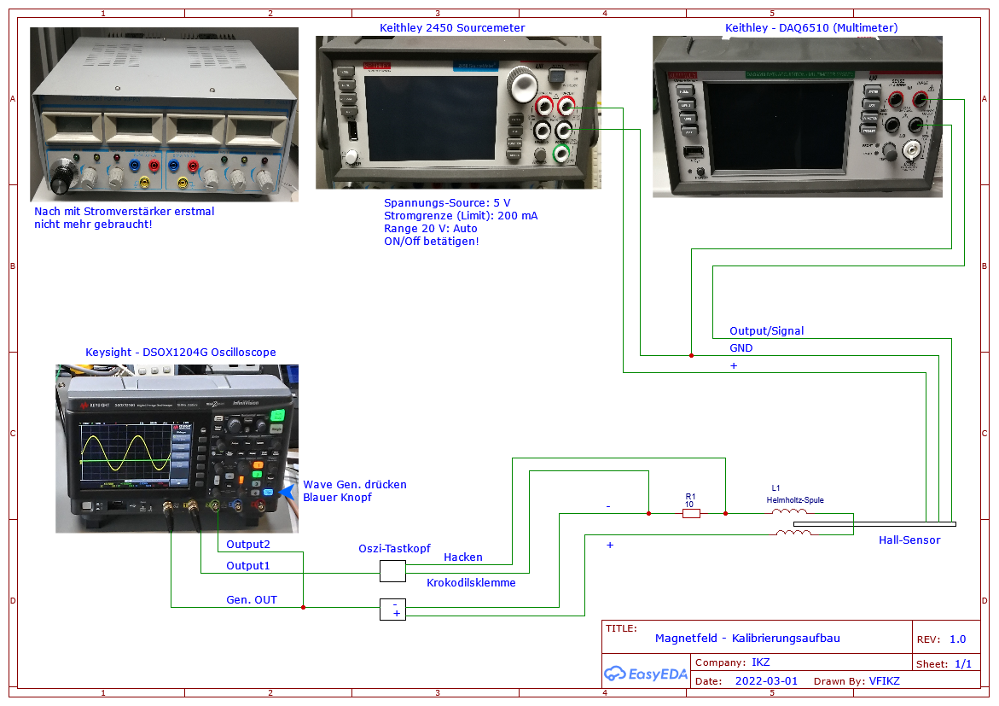
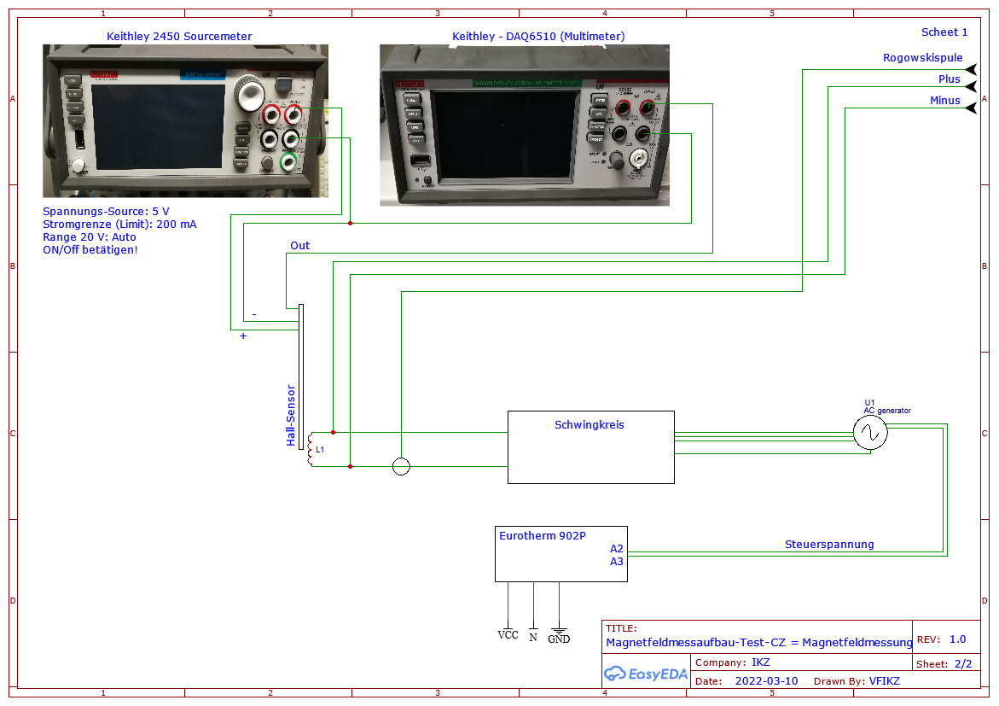
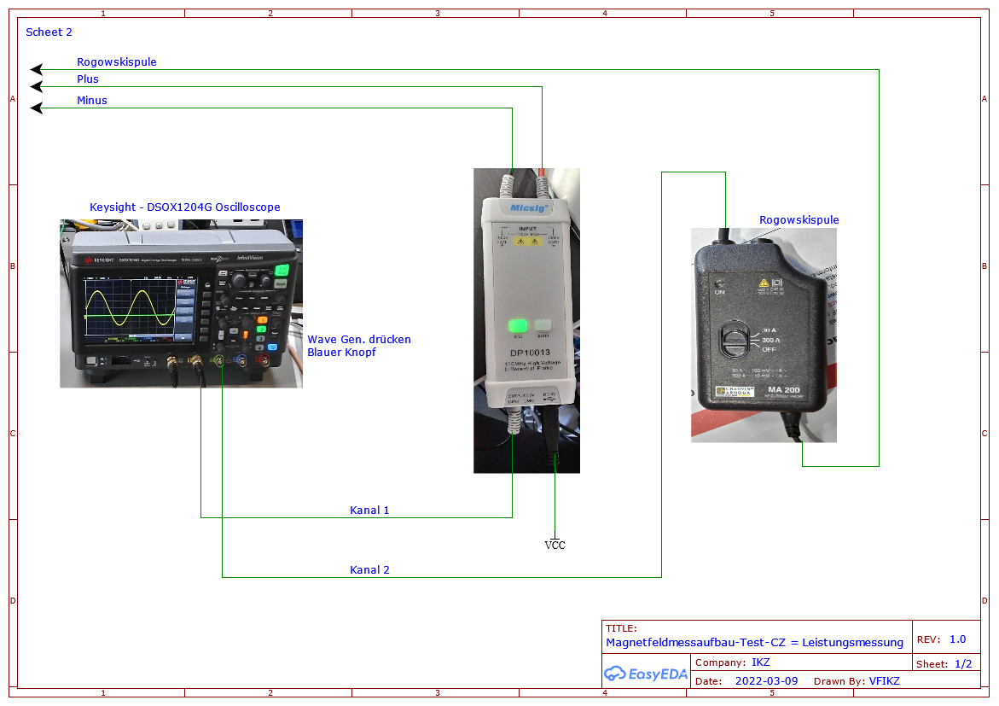

# exp-B-control

Control software for measurement devices to analyze magnetic field, power and other electromagnetic parameters.

These programs were created during Vincent Funke's Bachelor's thesis (in German) "Resistive und induktive Heizung in einer Kristallzüchtungsanlage: Automatisierung mit Python und Vermessung der elektromagnetischen Parameter" (see [Documents](#Documents)). The [Model Experiments Group](https://www.ikz-berlin.de/en/research/materials-science/section-fundamental-description-1) at the Institute for Crystal Growth (IKZ) was supported in this work. 

## Experiment: Magnetic field control

In the context of the experiment to control the magnetic field, two experiments were carried out:

1. Calibration of a Hall sensor
2. Magnetic field measurement in the facility (Test-CZ) of the model experiments group

Various devices are used for this, which can be found under the item [Supported devices](#Supported devices). The aim is to determine the magnetic field of coils.

The validation and the first tests were carried out with a self-wound Helmholtz coil. The coil has a diameter of 20 mm and 60 turns per coil section.

In the experiment, the magnetic field of coils is to be determined with the help of three devices. The first tests and validation are to take place with a Helmholtz coil. A Hall sensor was calibrated with the Helmholtz coil. When considering the setup, a current amplifier was also built, but this was not used further after failed tests.

In the test CZ (also called the Nemo-1 system), the magnetic fields of the system coil are now to be recorded with the help of the Hall sensor and the calibration values. A Hall sensor is used for the measurement, with which the Hall voltage is measured. This voltage is then converted into the magnetic flux density for calibration using a formula. A calibration curve can then be created with which the measurements can then be converted.

## Experiment: Performance measurement of resistive and inductive heaters

The experiment was about determining the performance of the various heaters (resistance heaters and induction heaters). Voltage (voltage measurement with differential probe - DP10013 from Micsig) and current measuring devices (Rogowski coil type MA 200) are used and evaluated using an oscilloscope. The program reads out the measurement data from this device and saves the curve on the device.

## Experiment setup:
### Hall sensor calibration

### Magnetic field measurement in the test CZ system

### Power measurement in the test CZ system

## Supported devices

The Keysight oscilloscope is used to change the frequencies and amplitudes, the Keithley multimeter measures the Hall voltage and the source meter (not programmed) provides the supply voltage.

1. Keysight DSOX1204G oscilloscope (USB)
2. Keithley DAQ6510 multimeter (RS232)

## Programs

### Main programs
1. [hauptprogramm_Kalibrierung.py](hauptprogramm_Kalibrierung.py)
    - Calibration program for Hall sensor (recording measurement data)
2. [hauptprogramm_Leistung.py](hauptprogramm_Leistung.py)
    - Measuring the performance by recording the oscilloscope curves
3. [hauptprogramm_Profil.py](hauptprogramm_Profil.py)
    - Recording magnetic field profiles of a coil

### Evaluation programs

1. [Auswertung_Text-Datei.py](Auswertung/Auswertung_Text-Datei.py)
2. [Profil_Kurvenschar_Weg-Rot_Magnetfeld.py](Auswertung/Profil_Kurvenschar_Weg-Rot_Magnetfeld.py)
3. [Profil_Kurvenschar_Zeit_Hall-Spannung.py](Auswertung/Profil_Kurvenschar_Zeit_Hall-Spannung.py)
4. [Profil_Umrechnung.py](Auswertung/Profil_Umrechnung.py)

### Test programs
With the two test programs you can easily test commands.

**Keithley:**    
[Kommunikationstest_1-Keithley-DAQ.py](Test-Programme/Kommunikationstest_1-Keithley-DAQ.py)

In the program you will find various commands, some of which are commented out, which were simply used to create the program mentioned above in Chapter 1.

**Keysight:**  
[Kommunikationstest_2-Keysight-Oscilloscope.py](Test-Programme/Kommunikationstest_2-Keysight-Oscilloscope.py)

Im Programm findet man verschiedene Befehle, teilweise auch auskommentiert die einfach über die Erstellung der oben in Kapitel 1 genannten Programm verwendet wurden.

## Usage/ About the programs

1. Configuration using the Config (Yaml) file:
    - hauptprogramm_Kalibrierung.py - Template: [Beispiel_parameter_Kalibrierung.yml](Beispiel_Datein/Yaml/Beispiel_parameter_Kalibrierung.yml)
    - hauptprogramm_Leistung.py - Template: [Beispiel_parameter_Leistung.yml](Beispiel_Datein/Yaml/Beispiel_parameter_Leistung.yml)
    - hauptprogramm_Profil.py - Template: [Beispiel_parameter_Profil.yml](Beispiel_Datein/Yaml/Beispiel_parameter_Profil.yml)

    - When using, "Beispiel_" must be removed.

2. Remarks main/measurement programs:
    - hauptprogramm_Kalibrierung.py
        - `python .\hauptprogramm_Kalibrierung.py`
        - Processes loop
        - End: `print("\nProgramm abgearbeitet!")` 
        - Products (examples):
            - Path: Daten\Daten_vom_2022_03_02
            - File: 2022_03_02_#01_volt.txt ([Example](Beispiel_Datein/Hauptprogramm/Beispiel_Text_Datei_Kalibrierung.txt))
    - hauptprogramm_Leistung.py
        - `python .\hauptprogramm_Leistung.py`
        - Image is saved
        - Products (examples):
            - Path: Daten/Oszi-Daten_vom_2022_03_04
            - File:                 
                - 2022_03_04_Nr01_Leistung_Spannung_Vor-Widerstand.txt ([Example](Beispiel_Datein/Hauptprogramm/Beispiel_Text_Datei_Leistung.txt))
                - 2022_03_04_Nr01_Leistung_Spannung_Vor-Widerstand.png ([Example](Beispiel_Datein/Hauptprogramm/Beispiel_Bild_Datei_Leistung.png))
    - hauptprogramm_Profil.py
        - `python .\hauptprogramm_Profil.py`
        - tkinter environment opens
        - Live plot can be seen
        - Products (examples):
            - Path: Daten/Daten_vom_2022_03_10/Profil
            - File:    
                - 2022_03_10_#01_Profil.txt ([Example](Beispiel_Datein/Hauptprogramm/Beispiel_Text_Datei_Profil.txt))       
                - 2022_03_10_#01_Profil_Bild.png ([Example](Beispiel_Datein/Hauptprogramm/Beispiel_Bild_Datei_Profil.png))

3. Evaluation programs:
    1. Auswertung_Text-Datei.py
        The folder [Daten](Daten) contains an example of this. When the program is started, a plot is created!
        - Enter file in variable `lese_File`: e.g. `2022_03_04_#01_volt.txt`
        - Start program: `python .\Auswertung_Text-Datei.py`
        - Enter the Hall voltage without magnetic field in mV and the series resistor in Ohm (console input)
        - Plot opens
        - Products (examples):
            - Path: Daten\Daten_vom_2022_03_02_#01
            - File: 2022_03_02_#01_volt_Bild_#01.png ([Example](Beispiel_Datein/Auswertung/Beispiel_Auswertung_Text-Datei.png))
    2. Profil_Kurvenschar_Weg-Rot_Magnetfeld.py
        The folder [Daten](Daten) contains an example of this. When the program is started, a plot is created!
        - Path and name are defined in the dictionary `data`
        - Start program: `python .\Profil_Kurvenschar_Weg-Rot_Magnetfeld.py`
        - [Example](Beispiel_Datein/Auswertung/Beispiel_Profil_Kurvenschar_Zeit_Hall-Spannung.png)
    3. Profil_Umrechnung.py
        The folder [Daten](Daten) contains an example of this. When the program is started, a plot is created! The result can be found there and is used for point 4!
        - Products (examples):
            Path: Daten/Profil-Umrechnung (Created in the execution folder!)
        - Specify path in variable `folder`
        - Specify movement (stroke, rotation) in `bewegung` and direction of movement (up, down or CCW, CW) in `richtung_hub` or `richtung_rot`
        - Specify values ​​in `weg_beginn`, `weg_Ende` and `rotation_Begin`
        - Start program: `python .\Profil_Umrechnung.py`
        - [Example_1](Beispiel_Datein/Auswertung/Beispiel_Bild_Datei_Umrechnung_Profil_Hub.png)
        - [Example_2](Beispiel_Datein/Auswertung/Beispiel_Bild_Datei_Umrechnung_Profil_Rot.png)
            - more in the said upper folder!
    4. Profil_Kurvenschar_Weg-Rot_Magnetfeld.py
        The folder [Daten](Daten) contains an example of this. When the program is started, a plot is created!
        - Path and name are defined in the dictionary `data`
        - Start program: `python .\Profil_Kurvenschar_Weg-Rot_Magnetfeld.py`
        - [Example](Beispiel_Datein/Auswertung/Beispiel_Profil_Kurvenschar_Weg-Rot_Magnetfeld.png)

## Dependencies

The programs work with Python. Windows and Raspberry Pi were used.

**Libraries used:**

1. hauptprogramm_Kalibrierung.py
    - numpy
    - serial
    - yaml
    - datetime
    - os
    - subprocess
    - time
    - usbtmc

2. hauptprogramm_Profil.py
    - serial
    - time
    - datetime  
    - tkinter                           
    - numpy                              
    - matplotlib
    - os
    - yaml
    - subprocess  

3. hauptprogramm_Profil.py
    - usbtmc
    - numpy
    - matplotlib
    - os
    - yaml
    - datetime

4. Auswertung_Text-Datei.py
    - numpy 
    - matplotlib
    - os

5. Profil_Kurvenschar_Weg-Rot_Magnetfeld.py
    - numpy 
    - matplotlib
    - os

6. Profil_Kurvenschar_Zeit_Hall-Spannung.py
    - numpy 
    - matplotlib
    - os

7. Profil_Umrechnung.py
    - numpy 
    - matplotlib
    - os
    - math 

8. Kommunikationstest_1-Keithley-DAQ.py
    - serial
    - time

9. Kommunikationstest_2-Keysight-Oscilloscope.py
    - usbtmc   
    - numpy
    - matplotlib
    - os

## Documents

Further information about the programs and their use, as well as information about the experiment, can be found in Vincent Funke's Bachelor's thesis (in German): "Resistive und induktive Heizung in einer Kristallzüchtungsanlage: Automatisierung mit Python und Vermessung der elektromagnetischen Parameter". It is available online [here](https://nemocrys.github.io/papers/Bachelorarbeit_Vincent_Funke_ohneUS_Logo.pdf).

## Information

In the folder **[Info](Info)** there are further documents that describe the programs in more detail. The following topics can be found there in German and English:

1. Explanation of the commands and commissioning:
    - [Show En](Info/geräte_Befehle_etc_En.md)
    - [Show De](Info/geräte_Befehle_etc_DE.md)
2. Explanation of the program code:
    - [Show En](Info/Programm_Info_En.md)
    - [Show De](Info/Programm_Info_DE.md)
3. Evaluation programs:
    - [Show En](Info/Auswertung_En.md)
    - [Show De](Info/Auswertung_De.md) 
4. Readme in German
    - [Show](Info/Readme_DE.md)

## Acknowledgements

[This project](https://nemocrys.github.io/) has received funding from the European Research Council (ERC) under the European Union's Horizon 2020 research and innovation programme (grant agreement No 851768).

