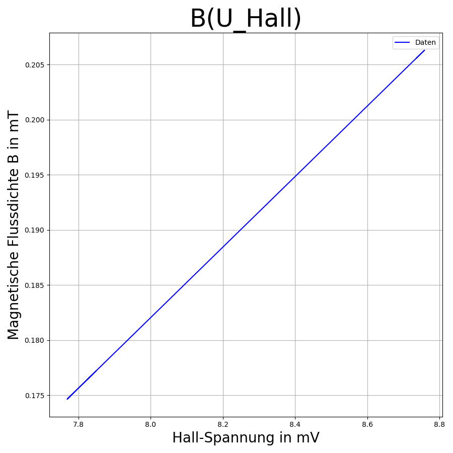

# exp-B-control
# Magnetic field control
In dem Experiment sollen mit Hilfe drei Geräte das Magnetfeld von Spulen bestimmt werden. Die ersten Test und die Validierung sollen mit einer Helmholtzspule stattfinden.    
Für das Experiment wurde eine neue Spule gewickelt und ein Stromverstärker gebaut. Dadurch soll es möglich sein größere Magnetfelder zu erzeugen. Die Experimente mit dem Stromverstärker waren nicht erfolgreich, weshalb man wieder auf einen Alten Aufbau zurückgegriffen hat. Bei dem Aufbau wurde der Hall-Sensor in eine Helmholtzspule mit 20 mm Durchmesser und 60 Windungen je Spulenteil gesteckt. Damit wurde dann eine Kalibrierung durchgeführt. 
Schlussendlich soll dann auch noch in der Test-CZ Anlage das Magnetfeld mit Hilfe des Programms gemessen werden.

Zur Messung wird ein Hall-Sensor verwendet. Mit dem Sensor wird die Hall-Spannung gemessen. Diese Spannung wird dann für die Kalibrierung über eine Formel umgerechnet in die magnetische Flussdichte. Daraufhin kann man eine Kalibrierungskurve erstellen mit der dann die Messungen umgewandelt werden können. 

Mit dem Oszilloskop von Keysight sollen die Frequenzen und Amplituden verändert werden, das Multimeter von Keithley misst die Hall-Spannung und das Sourcemeter (nicht programmiert) liefert die Versorgungsspannung. 

---
## 1. Programme
Die Programm die im folgenden genannt werden arbeiten alle mit Spulen. Zum einen gibt es ein Programm zur Kalibrierung, zur Messung der Leistung der Spule und um Profile an der Test-CZ Spule aufzunehmen. Die Programm werden im folgenden erklärt.

### 1.1. hauptprogramm_Kalibrierung.py
Das Programm wurde für die Kalibrierung eines Hall-Sensors mithilfe einer Helmholtzspule genutzt. Das Programm redet mit dem Multimeter von Keithley (DAQ) und dem Oszilloskop von Keysight. Über eine Parameterliste werden verschiedene Strings und Werte an das Programm übergeben.

**Programm Ablauf:**
1. Parameterliste (**parameter.yml**) auslesen und für das Programm verfügbar machen
2. Keysight Oszilloskop initialisieren 
    - VID und PID auslesen und übergeben
    - Identifikation (Name) abfragen und in Konsole ausgeben
3. Keithley gerät initialisieren
    - Schnittstelle initialisieren 
    - Geräte Reset ausführen
    - Geräte Namen ausgeben
4. den Wertebuffer für Keithley erstellen
5. die Bearbeitung der Frequenzen speichern
6. Experiment-Daten auslesen und schauen ob Frequenz von groß zu klein oder von klein zu groß läuft
7. Funktions-Typ und Amplitude der Spannung auslesen und an Gerät übergeben
8. GitHub Version auslesen
9. File-Namen erstellen sowie den Ordner und den File Kopf erstellen
    - Überschrift, Aktuelles Datum, GitHub Version
    - genutzte Geräte
    - Experiment Informationen wie: Genutzte Spule, Versorgung Hall-Sensor und Voreinstellungen      
    --> Alles wird aus der Parameterliste entnommen (außer Version und Datum)
10. Messung und Bearbeitung

Bis zu Punkt 10 werden die Grundlagen bearbeitet. Im Punkt 10 wird dnn die Messung der Hall-Spannung und die Änderung der Frequenz durchgeführt, wie die Zeilen genau funktionieren wird im folgenden erklärt.

**Messung:**    
Die Messung findet in einer **for-Schleife** statt. Diese for-Schleife läuft nach den Frequenz angaben. Z.B. wenn man von 20 Hz bis 20 kHz in 20 Hz Schritten läuft werden diese alle abgearbeitet. Bei der Angabe muss man beachten das die Schritte vom Anfangswert bis zum Endwert stimmig sind, da sonst grobe Schritte entstehen. Um den Endwert zu erreichen muss man diesen plus den Schritt Wert nehmen. Wenn man dies anders haben will muss man sich Schritt und Endwert anders berechnen. Das oben genannte Beispiel kann auch umgedreht werden, dafür muss man in der Parameterliste unter **Frequenz** **reverse** nur auf True stellen. Damit würde der Startwert zum Endwert und der Endwert zum Startwert, die Schrittzahl wird dann negativ. 

Zu Beginn der Messung wird die aktuelle Frequenz an das Oszilloskop übergeben. Um dem Gerät etwas zeit zulassen gibt es hier ein Delay von 1s. Danach wird der aktuelle RMS Wert der Spannung ausgelesen (Angabe des Kanals - hier Spannung über dem Vorwiderstand der Spule) und gespeichert. 

In der **while-Schleife** wird nun der Strom bzw. die Spannung konstant gehalten (I = U/R --> U und I sind proportional - R konstant). Über die Parameterliste kann man den Sollwert, den gewollten Bereich und die Berichtigung von Vpp angeben. Sollte der aktuelle Spannungswert nicht in dem Bereich liegen, so wird die Schleife ausgeführt. Dabei wird die Schleife solange ausgeführt bis die Amplitude (Vpp) der Generator-Spannung eine Spannung am ausgewählten Kanal erzeugt die in dem Bereich liegt. Jenach dem ob die Spannung größer oder kleiner ist wird die Amplitude nach oben oder unten berichtigt, jedoch kann der Wert nicht über 12 V steigen, da dort das Maximum des Gerätes liegt.     
Nach der Berichtigung wird die Amplitude an das Gerät gesendet und die Spannung am Gewählten Kanal erneut bestimmt.

Sollte der Wert im Bereich liegen, so wird das Multimeter, also die Hall-Spannung abgefragt. Zu Begin (nach ersten Messung) gibt es ein Delay von 5s in dem Programm. Diese Verzögerung kommt aus den Testen mit dem Gerät, da das Gerät eine gewisse Zeit brauch um den AC Kanal auszuwählen und den ersten Messwert anzugeben. Danach läuft dann alles.    
Im Anschluss wird doe Spannung ausgelesen, die Einheit ermittelt und mit der Funktion **um** der Wert in Volt umgerechnet. Im Anschluss wird sich auch der Spannungswert am Kanal und die Amplitude des Oszilloskop gespeichert und in das File angehangen. 

Ist das Programm fertigt wird das durch eine Konsolenausgabe bestätigt. 

**Funktionen**    
Die **Read_Ausgabe()** Funktion dient nur dem Auslesen des Multimeters.

Da das Multimeter so ausgelesen wird, das der genaue Wert vom Bildschirm genommen wird, wird auch die Einheit mit ausgelesen. Über die Funktion **um()** kann man die Einheit in Volt umrechnen. Die Funktion stammt aus meinem Studium an der HTW aus dem Modul Softwartechnik, aus einer der Laboraufgaben. Die Funktion bekommt den Wert, die aktuelle Einheit und die Wunscheinheit. Über die Liste **einheit** funktioniert die Funktion. Zunächst wird der Listenplatz der Wunscheinheit und aktuellen Einheit gesucht. Aus der Differenz der beiden Werte mit 3 multipliziert erhält man die 10 Potenz zur Umrechnung. 

Beispiel:    
- gewollt sind V   
    - Listenplatz = 3 = e2
- haben tut man mV   
    - Listenplatz = 2 = e1
- Wert = 1000
- Berechnung:     
    - new_wert = wert x 10^((e1-e2) x 3) = 1000 x 10^((2-3) x 3) = 1000 x 10^(-3) = 1

Aufgrund von Problemen mit der Umwandlung zu float wurden bei mV und kV Rundungen eingefügt. 

**Auswerten der Daten:**   
Mit dem Programm **Auswertung_Text-Datei.py** werden Diagramme zu dem erstellten Textdokument erstellt. Das Programm ist recht simple:
    - es liest alle Zeilen aus (überspringt den Kopf)
    - Hall-Spannung ohne Magnetfeld und Vorwiderstand muss über Konsole eingegeben werden (steht aber auch in der Text-Datei (kommt auf Version an))
    - berechnet Strom und magnetische Flussdichte
    - gibt alles über die Zeit in fünf Diagrammen aus
    - speichert das Diagramm automatisch

Diagramm:    

Mit dem Programm **Magnetfeld_Kalibrierung_B_von_Hall-U.py** wird die Kurve B(U_Hall) erstellt. Es liest das gegebene File aus und speichert ein daraus erstelltes Diagramm und ein File mit den beiden Werten!

---

### 1.2. hauptprogramm_Leistung.py
Mit diesem Programm kann man den Bildschirm des Keysight Oszilloskops auslesen. Dabei werden alle y-Werte in einem String vom Gerät zurückgegeben und die Sampling-Rate der Kurve. Insgesamt gibt es 4 Kanäle, diese Kanäle können über die Parameterliste **parameter_Leistung.yml** belegt werden. Über die Liste werden die VID und PID Nummern übergeben, die Anzahl der Kurven für das Diagramm mit Kanalnummer und Kurven Label. Des weiteren kann man unter **Messung** eine Notiz zum Zeitpunkt der Messung angeben. Im Programm kommt diese dann in den Kopf des Files mit einen Zeitstempel. 

Das Programm arbeitet mit Klassen. Jede Kurve bekommt dann eine eigene Klasse, in dem die Werte der Parameterliste gespeichert werden und die Daten aus dem Oszilloskop ausgelesen werden. Zudem bekommt jede Kurve ihre eigene Text-Datei bzw. in der Klasse ihren eigenen File-Namen.

Neben dem erstellen der Text-Datei werden die Daten in einem Diagramm geplottet. Für jedes Objekt wird die Textdatei mit dem File-Namen erstellt und die Kurve erzeugt. Das Gerät hat selber bestimmte Farben bei den Kanälen, dies wurde hier auch implementiert. 
- Kanal 1 - Gelb (hier Gold)
- Kanal 2 - Grün
- Kanal 3 - Blau
- Kanal 4 - Rot

Im Kopf der Text-Datei stehen die Zeitschritte (Sampling-Rate) und wann die Messung durchgeführt wurde. Danach werden die ausgelesenen Daten eingetragen.
Im nächsten Schritt werden die Diagrammdaten erstellt, die y-Werte werden in floats umgewandelt. Bei diesem Schritt sollen Leerzeilen übersprungen werden, bei einigen Testen (ohne Kurve) sind Leerzeilen entstanden die das Programm abstürzen ließen. Aus diesem Grund sollen nur Textzeilen beachtet werden und ein Fehler bei der Umwandlung mit float() ausgegeben werden. Wenn das alles geklappt hat, wird die Kurve erstellt.

Mit dem abschließen der letzten Kurve bzw. letztem Objekt, wird das Diagramm erstellt, welches im folgenden gespeichert wird. Ordner und name werden vom Diagramm selbst erstellt. Hier muss man aber aufpassen, da die Namen separat erstellt werden, das heißt das es hier zu Unordnung kommen kann wenn man nicht aufpasst. 

Dieses Programm kann auch für andere Anwendungen mit dem Oszilloskop genutzt werden. 

---

### 1.3. hauptprogramm_Profil.py
Das Programm wurde zum erstellen der Profile für die Entwicklung des Magnetischen Feldes bei einem bewegenden Hall-Sensors geschrieben. 

Die Struktur des Programmes stammt aus dem AutoTune Programmen der Emissivitätsbestimmung (exp-T-control-v2). Auch hier wird die Funktion **um()** genutzt. Das Programm nimmt die Hall-Spannung auf und plottet diese Live über der Zeit. 

**Programmablauf:**    
1. Variable **nStart** auf False setzen
2. Parameterliste (parameter_Profil.yml) zu Verfügung stellen
3. Keithley Multimeter (DAQ) initialisieren (Schnittstelle)
4. Gerät Reset durchführen
5. Gerätenamen auslesen
6. Buffer erzeugen
7. GUI erstellen (Funktion aufrufen) - simple GUI nur Start und Beenden
8. Start betätigen
    - File wird mit File-Kopf erzeugt (eintragen der Voreinstellungen und Experimentablauf Daten aus der Parameterliste), Ordner erstellt
    - Start Zeit bestimmt
    - nStart auf True gesetzt - Freischaltung der Funktion und erneutes Start drücken verhindern
    - Grafik wird erzeugt
9. get_Measurment() wird ausgeführt (bestens alle Sekunde)
    - dt wird bestimmt
    - Multimeter wird angesprochen, frage nach Hall-Spannung
        - Aufruf des 5s Delays beim ersten mal
    - Aufruf Funktion um()
    - Listen aktualisieren 
    - File erweitern
    - Grafik updaten (mit Autoscaling)
10. bei Betätigen von Stop
    - Messung wird beendet
    - Bild wird gespeichert
    - Programm wird beendet

**Auswertungsdatei:**     
Mit dem Programm **Profil_Zeit_Hall-Spannung.py** kann man durch Angabe in einem Dictionerie die Profil-Daten neben einander darstellen!

Dafür werden die Kurven aus ihren Textdateien in einer Schleife ausgelesen und zusammen geplottet. Das Diagramm muss von Hand gespeichert werden. 

---
## 2. Weiteres
Einige Teile der Programme wurden aus den verschiedenen anderen Programmen wie Emissionsgradbestimmung/Temperaturegelung und AutoTune entnommen. Zum Beispiel die Programmstruktur für die Profil-Bestimmung stammt aus den AutoTune Programmen. Auch sich immer wieder wiederholende Programmzeilen wie File und Ordenr erstellen, den Filenamen erstellen oder auch die Version von GitHub lesen sind hier wieder mit dabei. 

### 2.1. Programmquellen
- https://dev.to/days_64/python-hex-function-convert-decimal-to-hexadecimal-33am
    - Nutzung von hex()

### 2.2. Beispiel Datei  
In dem Ordner "Beispiel Datein" liegen die Yaml-Dateien die für die Programme relevant sind drin!   
*Bei dem Namen der Datei muss dann nur das "Beispiel_" entfernt werden!*

### 2.3. Info
Im gleichnamigen Ordner liegen Datein die weiter Informationen enthalten. 

**Bisher:**
1. geräte_Befehle_etc.md
    - Genutzte Geräte
    - Genutzte Gerätebefehle im Programm
    - Schnittstellen Einstellung
    - Manual Quellen

### 2.4. Test-Programme
Mit den beiden Testprogramm kann man einfach Befehle austesten.

**Keithley:**    
Kommunikationstest_1-Keithley-DAQ.py

Im Programm findet man verschiedene Befehle, teilweise auch auskommentiert die einfach über die Erstellung der oben in Kapitel 1 genannten Programm verwendet wurden.

**Keysight:**  
Kommunikationstest_2-Keysight-Oscilloscope.py

Im Programm findet man verschiedene Befehle, teilweise auch auskommentiert die einfach über die Erstellung der oben in Kapitel 1 genannten Programm verwendet wurden.